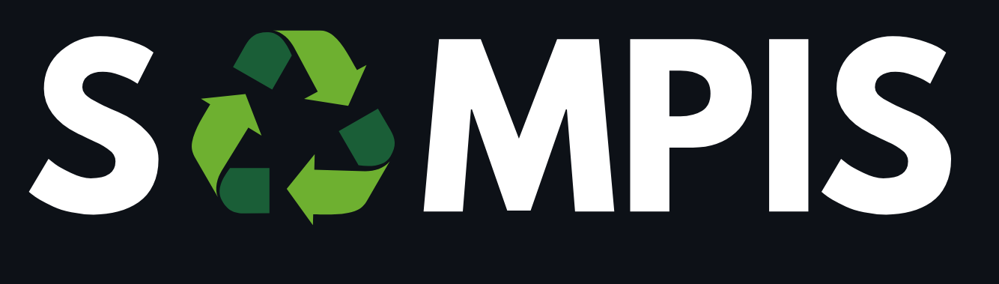

  <!-- Logo adaptif yang berubah sesuai tema GitHub -->
  

  <h3><b>Sampah Rapih, Bumi Happy!</b></h3>

### 🧩 What's this ?
SAMPIS adalah project capstone dari program Coding Camp 2025. Project ini dibangun oleh tim `CC25-CF090` yang beranggotakan 3 member Machine Learning dan 3 member FEBE. 

  <h3> 👥 Team Members 👥</h3>
  <table align="center">
    <tr>
      <th>Learning Path</th>
      <th>Cohort ID</th>
      <th>Name</th>
    </tr>
    <tr>
      <td>Machine Learning</td>
      <td>MC009D5X0413</td>
      <td>Nabila Alawiyah</td>
    </tr>
    <tr>
      <td>Machine Learning</td>
      <td>MC009D5Y0435</td>
      <td>Adam Firmansyah</td>
    </tr>
    <tr>
      <td>Machine Learning</td>
      <td>MC009D5Y0823</td>
      <td>Ferry Pebriansyah</td>
    </tr>
    <tr>
      <td>FEBE</td>
      <td>FC009D5Y0583</td>
      <td>Arrahman Akmal</td>
    </tr>
    <tr>
      <td>FEBE</td>
      <td>FC009D5Y0871</td>
      <td>Mohamad Kemal Rasyidin</td>
    </tr>
    <tr>
      <td>FEBE</td>
      <td>FC009D5Y1707</td>
      <td>Ahmad Zild Bilaldi</td>
    </tr>
  </table>

### 🗑️ Project Description
**SAMPIS** adalah platform manajemen sampah berbasis website dan teknologi Machine Learning yang memungkinkan masyarakat untuk:
- Menklasifikasikan jenis sampah rumah tangga secara otomatis.
- Menghasilkan **Sampoint**, poin digital yang dapat ditukar dengan hadiah.

### 🌎 How to Access Website 🌳
- **[S♻️MPIS](https://sampis.netlify.app/)**
